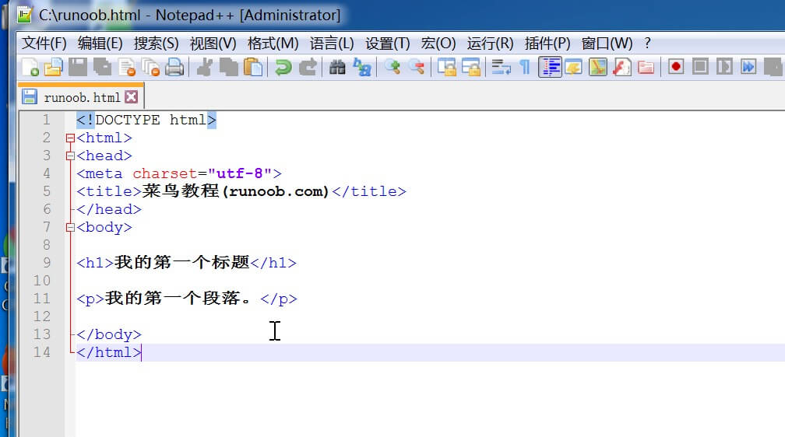
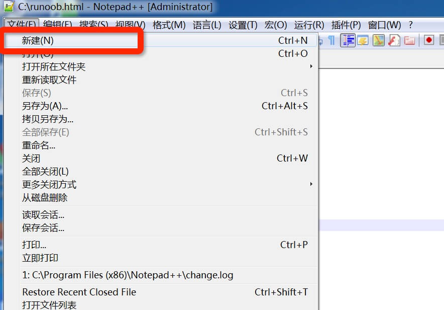

# HTML 编辑器

--------

## HTML 编辑器推荐

可以使用专业的 HTML 编辑器来编辑 HTML，菜鸟教程为大家推荐几款常用的编辑器：

 * Notepad++：[https://notepad-plus-plus.org/](https://notepad-plus-plus.org/)
 * Sublime Text：[http://www.sublimetext.com/](http://www.sublimetext.com/)
 * HBuilder：[http://www.dcloud.io/](http://www.dcloud.io/)你可以从以上软件的官网中下载对应的软件，按步骤安装即可。

接下来我们将为大家演示如何使用Notepad++工具来创建 HTML 文件，其他两个工具操作步骤类似。

--------

## Notepad++

Notepad++是 Windows操作系统下的一套文本编辑器(软件版权许可证: GPL)，有完整的中文化接口及支持多国语言编写的功能(UTF8技术)。

### 步骤 1: 新建 HTML 文件

在 Notepad++ 安装完成后，选择" 文件(F)->新建(N) "，在新建的文件中输入以下代码：

```HTML
<!DOCTYPE html>
<html>
<head>
<meta charset="utf-8">
<title>菜鸟教程(runoob.com)</title>
</head>
<body>

<h1>我的第一个标题</h1>

<p>我的第一个段落。</p>

</body>
</html>
```



### 步骤 2: 另存为 HTML 文件

然后选择" 文件(F)->另存为(A) "，文件名为 runoob.html:



当您保存 HTML 文件时，既可以使用 .htm 也可以使用 .html 扩展名。两者没有区别，完全根据您的喜好。

在一个容易记忆的文件夹中保存这个文件，比如  **runoob**

### 步骤 3: 在浏览器中运行这个 HTML 文件

启动您的浏览器，然后选择"文件"菜单的"打开文件"命令，或者直接在文件夹中双击您的 HTML 文件,

运行显示结果类似如下:


> Notepad++ 和 Sublime Text 还可以配合 Emmet 插件来提高编码速度。

Emmet 官网：[http://emmet.io/](http://emmet.io/)
